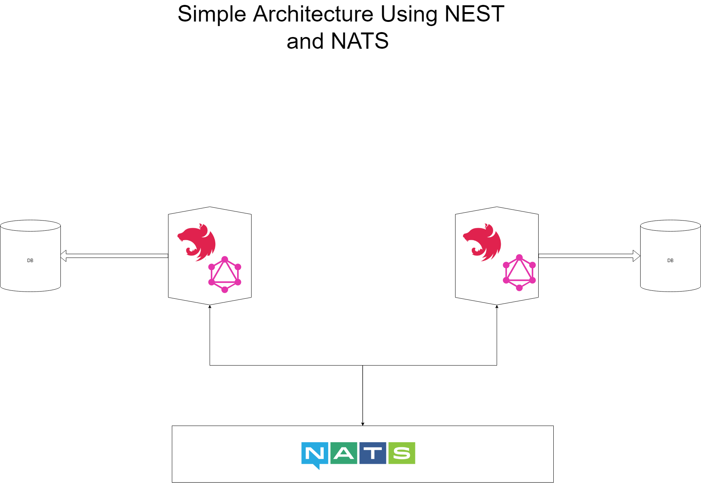

# NEST with NATS

This is a simple example of a NEST microservice using NATS.

## Architecture

There are two microservices in this example:
1. service1
2. service2

- `service1` can create a new user and can send user data to `service2` for processing.
`service2` can approve or reject the user and can send the result to `service1`.

- `service1` requests `service2` for all approved users.

- `service2` requests `service1` for all rejected users.

Every request and response is sent over NATS.

## Setup

To run the example, you need to have a NATS server running. For that you can use `docker-compose up -d`. Server will be started in the background.

Navigate to the service1 and service2 directories and run `npm i` and `npm run start:dev`.

- Serivce1: start port: `4322`
- Service2: start port: `4321`

Note: Current example is graphql.